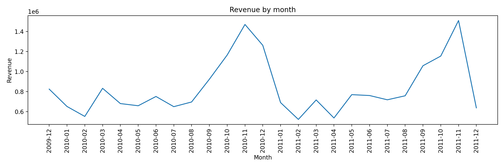

# E-commerce Sales Analysis — EDA (Excel + SQLite)

Exploratory analysis of the **Online Retail II** dataset (500k+ transactions).  
Investigated **revenue trends**, **top-selling products**, **seasonality**, and **customer purchasing behaviour**.

## Stack
- Excel (Power Query, Pivot Tables, Dashboard)
- SQL (SQLite)

## Dataset
- Source: https://www.kaggle.com/datasets/mashlyn/online-retail-ii-uci  
- Main fields: InvoiceNo, StockCode, Description, Quantity, InvoiceDate, UnitPrice, CustomerID, Country
- https://www.kaggle.com/code/rafaelamachadosoares/ecommerce-sales-analysis-eda

> Note: Raw data is not included in this repo due to size/licensing.  
> Download it from Kaggle and import it into SQLite.

## Business Questions
1. How does revenue change over time?
2. What are the top-selling products by units and revenue?
3. Is there seasonality by month / weekday?
4. Which countries contribute most to revenue?
5. What does customer behaviour look like (RFM-style)?

## Data Cleaning (high level)
- Filtered invalid rows (Quantity <= 0, UnitPrice <= 0)
- Standardized date parsing for time-based analysis
- Created `Revenue = Quantity * UnitPrice`
- Excluded cancelled invoices (Invoice starting with "C")

## Key Insights
- The **United Kingdom** was the main revenue driver, generating **£17,870,977.78** across **36,535 orders**.
- Peak monthly performance occurred in **2011-11**, reaching **£1,509,496.33** in revenue.
- The top product by revenue was **REGENCY CAKESTAND 3 TIER**, generating **£344,563.25** from **27,577 units sold**.
- Two other strong revenue contributors were **Manual (£340,716.28)** and **DOTCOM POSTAGE (£322,657.48)**.

## Visuals

## How to reproduce (SQLite)
1. Create a SQLite database (e.g., `ecommerce.db`)
2. Run `sql/01_create_tables.sql`
3. Import the dataset into table `sales`
4. Run `sql/02_cleaning.sql` and `sql/03_analysis.sql`

## Quick KPIs
| Metric | Value |
|---|---:|
| Total revenue | £17,870,977.78 (UK only, top country) |
| Best month | 2011-11 (£1,509,496.33) |
| Top product | REGENCY CAKESTAND 3 TIER (£344,563.25) |

## Outputs (CSV)
- [Revenue by month](outputs/tables/revenue_by_month.csv)
- [Revenue by weekday](outputs/tables/revenue_by_weekday.csv)
- [Top countries](outputs/tables/top_countries.csv)
- [Top products](outputs/tables/top_products.csv)

## License
MIT
